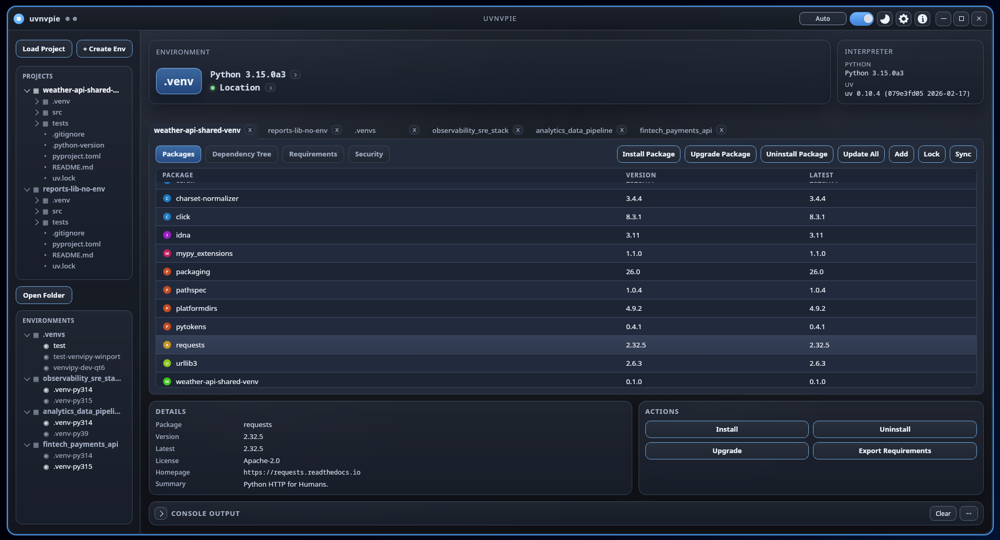
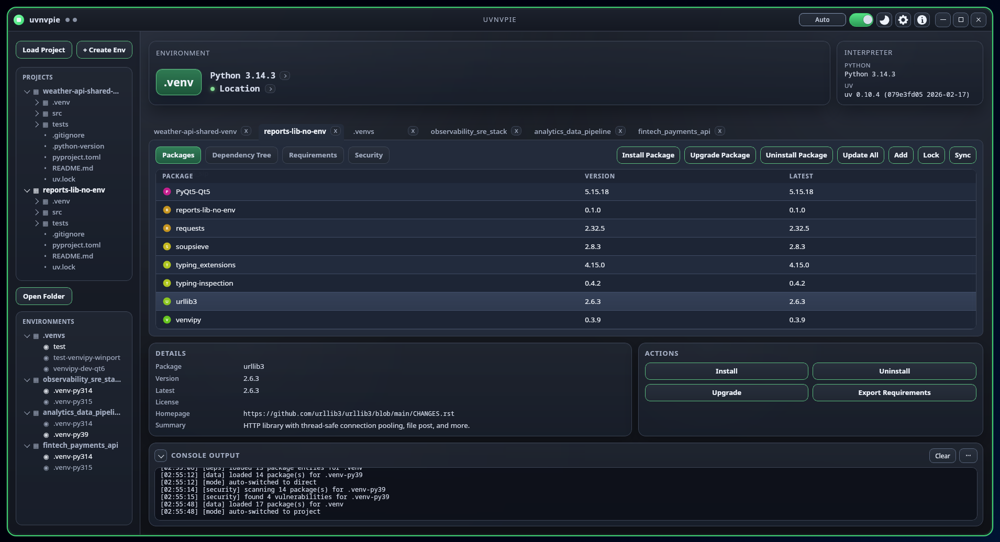
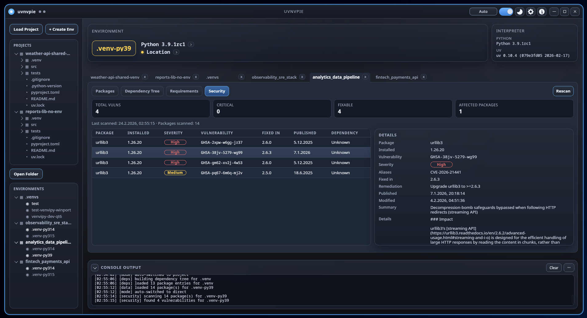
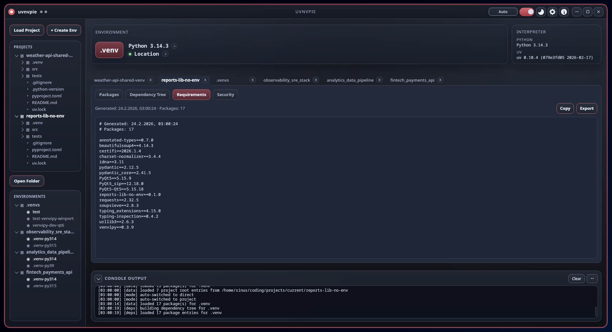
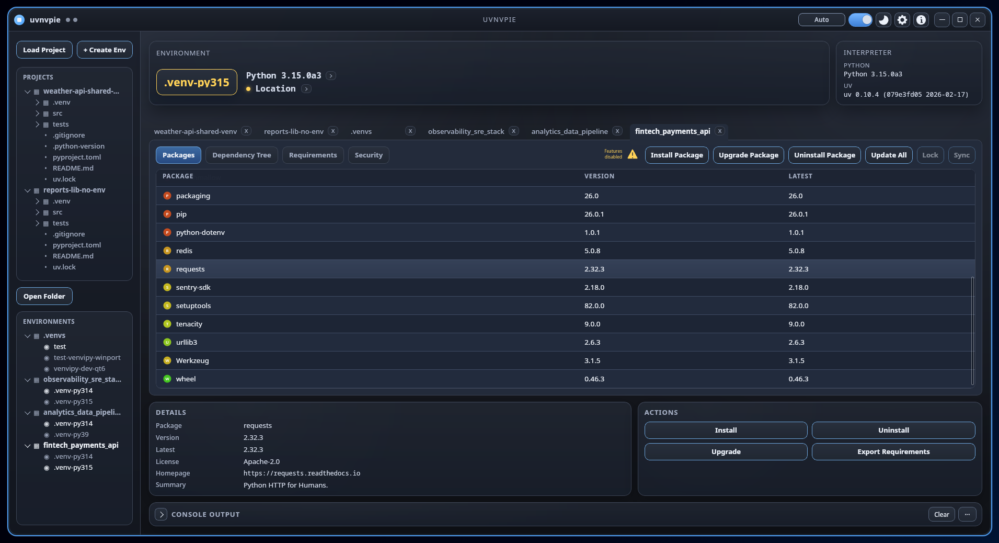

# uvnvpie

<p align="center">
  
</p>

<p align="center">
  
</p>

<p align="center">
  
</p>

<p align="center">
  
</p>

<p align="center">
  
</p>

EN | [DE](README.de.md)

[](https://www.rust-lang.org)
[](https://v2.tauri.app)
[](https://nodejs.org/en)
[](https://pnpm.io)
[](https://react.dev)
[](https://vite.dev)
[](https://tailwindcss.com)
[](https://paypal.me/yserestou)

Next-gen virtual environment manager for Python.
Built with Rust + Tauri, using `uv` as execution backend.

## Project Status

| Area | Status |
| --- | --- |
| Version | **v0.1.1** |
| Platforms | Linux, Windows |
| Runtime | Desktop app (Tauri v2) |
| Data Sources | Local Python metadata + `uv` + OSV API |

## What Works Today

- Environment discovery from configurable root folders.
- Package inventory per selected environment.
- Dependency Tree tab with live graph metadata from interpreter packages.
- Requirements tab with generated preview, copy, and file export.
- Security tab with live OSV vulnerability scan and detailed finding view.
- Real `uv` command execution for package management actions in the main package toolbar.
- Streaming command output into the integrated console panel.
- Project mode, Direct mode, and Auto Switch mode in the title bar.
- Settings persistence via `tauri-plugin-store`.
- Native folder/file dialogs via `tauri-plugin-dialog`.
- Multi-workspace sidebar model for Environments and Projects.

## Requirements

- **Node.js** 20+
- **pnpm** 9+
- **Rust** stable (1.77+)
- **Python** installed (for environment introspection)
- **uv** available in `PATH` or configured in app settings
- **Tauri** system prerequisites:
  https://v2.tauri.app/start/prerequisites/

## Installation

```bash
pnpm install
```

## Development

Run full desktop app:

```bash
pnpm tauri dev
```

Run frontend only:

```bash
pnpm dev
```

## Build

```bash
pnpm tauri build
```

## Usage

1. Start the app with `pnpm tauri dev`.
2. Open one or more root folders from the sidebar actions.
3. Select an environment.
4. Use tabs to inspect:
   - `Packages` (table + detail panel)
   - `Dependency Tree`
   - `Requirements` (copy/export)
   - `Security` (OSV scan)
5. Run package actions from the package toolbar; monitor output in the console panel.

## Environment Detection

If an explicit environment root is configured, only that root is scanned.
Without an explicit root, these defaults are used:

- `~/.virtualenvs`
- `~/.venvs`
- `~/venvs`

An environment is recognized when one interpreter file exists:

- `<env>/bin/python`
- `<env>/bin/python3`
- `<env>/Scripts/python.exe`
- `<env>/Scripts/python`

## Requirements Export

Requirements export in the Requirements tab now uses:

1. Native save dialog (`tauri-plugin-dialog`)
2. Backend write command (`write_text_file`)

If native export fails in a runtime edge case, a browser-style download fallback is used.

## Backend Command Surface (Rust)

- `get_uv_version`
- `list_environments`
- `list_environment_packages`
- `list_environment_dependency_graph`
- `is_valid_project_root`
- `list_project_files`
- `write_text_file`
- `uv_add`
- `uv_lock`
- `uv_sync`
- `uv_upgrade`
- `uv_uninstall`
- `uv_direct_install`
- `uv_direct_upgrade`
- `uv_direct_uninstall`
- `uv_direct_update_all`

## Known Limitations

- The secondary **Actions** panel in the lower-right package area still triggers mock jobs.
  Primary package toolbar actions are the wired `uv` execution path.
- The `Latest` package column currently mirrors the installed `Version`.
- Security scan depends on external OSV services and requires network access.
- Environment discovery scans only first-level child directories inside each configured root.

## Changelog

See [CHANGELOG.md](CHANGELOG.md).

## License

See [LICENSE](LICENSE).
